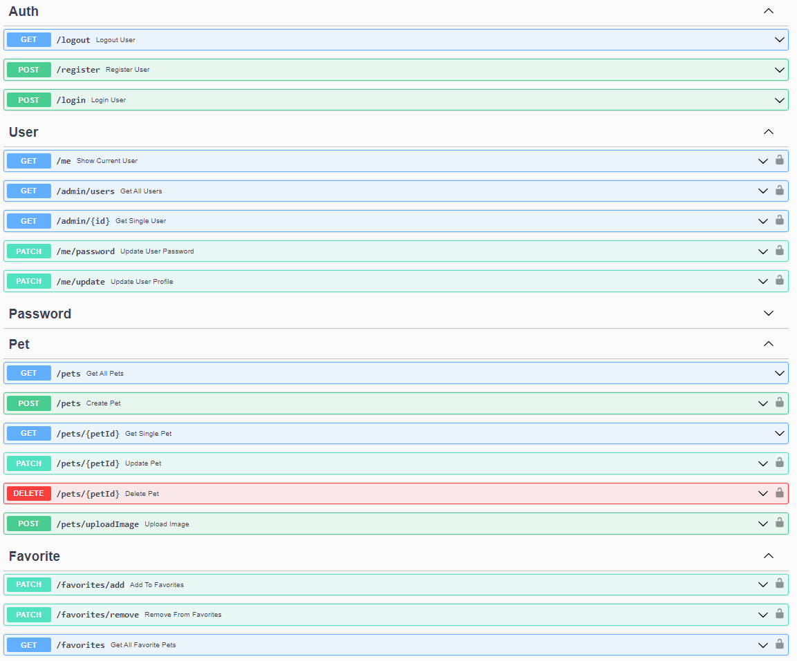

# Back-End Repo for Team 4 of Chimp/Cockatoo Practicum - Adopt the Dream App

## About Adopt the Dream

Welcome to Adopt the Dream! This application allows users to browse and adopt adorable pets in need of loving homes. With a user-friendly interface and a range of features, our app aims to connect pet lovers with their perfect furry companions.



## Setup

To set up the server locally, run the following:

```shell
npm i && npm run dev
```

> The back-end server will be running on port 8000. The front-end app will be running on port 3000. You will need to run both the back-end server and the front-end app at the same time to test your app.

## Built With

- JavaScript
- Express
- Mongoose
- jsonwebtoken
- bcryptjs
- [Stripe API](https://www.petfinder.com/developers/)

## Live Demo

A live demo is currently being hosted on render.com:

- [BackEnd](https://stripe.com/docs/api/)

## Features Include:

- User Registration: Users can create an account by providing their basic information. Registration allows them to access additional features and personalize their experience.
- User Profile: Each user has a profile page where they can view and update their personal information, manage their favorite pets, and track the status of their adoption applications.
- Browse Pets: Users can explore a wide variety of pets available for adoption. Each pet listing includes details such as breed, age, gender, and a brief description.

- Favorites: Users can add pets to their favorites list for easy reference. They can view and manage their favorite pets from their profile.
- Search: The search by name feature quickly retrieves relevant results from our extensive database of available pets.
- Filters: In addition to the search function, the Adopt the Dream App offers various filters that users can apply to further refine their search results.
  These filters enable users to specify their preferences based on specific attributes such as:
  Breed: Users can select one or multiple breeds from a comprehensive list to narrow down the search results to pets of the chosen breed(s).
  Age Range: Users can filter pets based on their desired age range, such as puppies, young adults, or seniors.
  Gender: Users can choose to view pets of a specific gender, whether male, female, or both.
  Size: Users can filter pets based on their size, such as small, medium, or large breeds.
- Adoption Process: Interested users can initiate the adoption process for a specific pet. This involves filling out an application form, which will be reviewed by pet shelter.
- Application Form: We have provided an adoption application form for interested users. The form collects essential information about the user, their living situation, and their preferences for adopting a pet.
- Adoption Confirmation: Once the adoption application is reviewed and approved, the user will receive a confirmation letter containing further instructions and details about the adoption process.
- Donate: We have a dedicated donation page for users who wish to contribute to shelter.

## Contributors

- Alona ([GitHub](https://github.com/AlonaVladymyrovaTrinity))
- Anna ([GitHub](https://github.com/arigakova))
- Luba ([GitHub](https://github.com/LiubovCass))
- Natasha ([GitHub](https://github.com/Nata-Kalina))
- Vitalii ([GitHub](https://github.com/vitaliipp))
